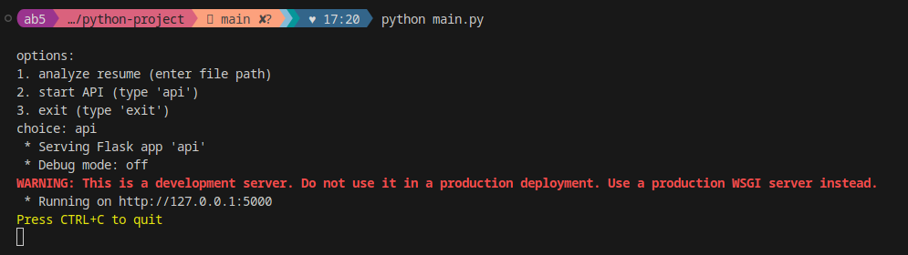
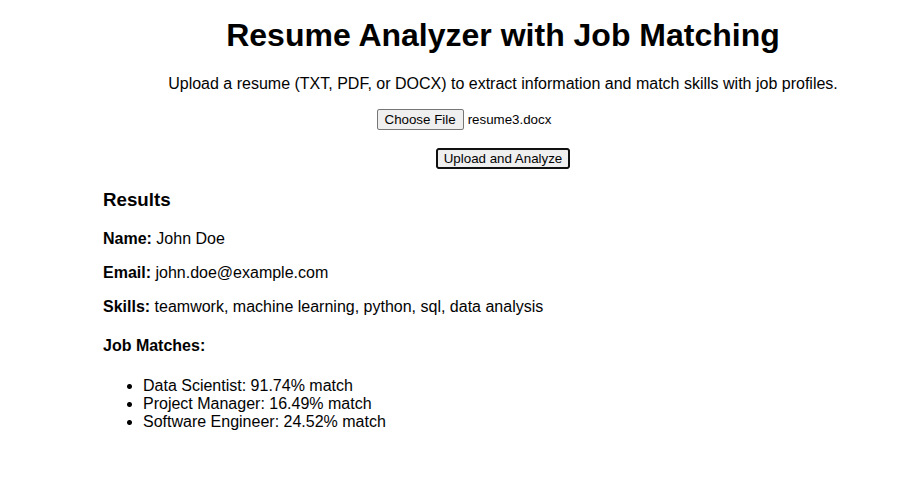
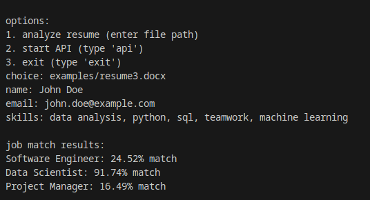
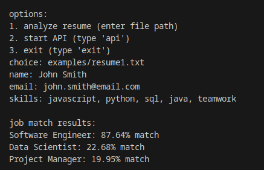
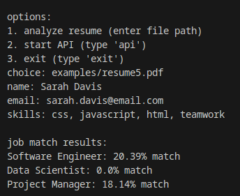

# Resume Analyzer Project Report

## Overview

This project is a resume analysis tool designed to extract key information from resumes and match candidate skills to job profiles. It supports both command-line interaction and a web API, allowing users to upload resumes in PDF, DOCX, or TXT formats. The tool extracts the candidate's name, email, and skills, then uses a skill-matching algorithm to evaluate compatibility with predefined job roles.

## Purpose

The purpose of this project is to automate the initial screening of resumes by identifying relevant candidate information and assessing how well their skills align with job requirements. It serves as a proof-of-concept for integrating natural language processing and machine learning techniques in recruitment processes.

## Approach

### 1. ResumeReader (resume_reader.py)

- **Functionality**: Reads and processes resume files (PDF, DOCX, TXT).
- **Key Features**:
  - Extracts text using `PyPDF2` for PDFs, `python-docx` for DOCX, and standard file reading for TXT.
  - Uses regular expressions to identify:
    - Name (first and last name pattern).
    - Email (standard email format).
    - Skills (predefined list: Python, Java, C++, SQL, JavaScript, HTML, CSS, Machine Learning, Data Analysis, Project Management, Teamwork, Communication).
  - Normalizes text to handle formatting inconsistencies.

### 2. SkillMatcher (skill_matcher.py)

- **Functionality**: Matches candidate skills to job profiles using TF-IDF and cosine similarity.
- **Key Features**:
  - Defines job profiles (Software Engineer, Data Scientist, Project Manager) with associated skills.
  - Uses `scikit-learn` to:
    - Convert skills to TF-IDF vectors.
    - Compute cosine similarity between candidate skills and job profiles.
  - Returns percentage match scores for each job role.

### 3. API (api.py)

- **Functionality**: Provides a web interface for resume uploads and analysis.
- **Key Features**:
  - Built with `Flask` to handle file uploads and return JSON responses.
  - Saves uploaded files to an `uploads` folder.
  - Integrates `ResumeReader` and `SkillMatcher` to process resumes and return extracted info and job match results.
  - Includes basic error handling (e.g., missing files, unsupported formats).

### 4. Main Script (main.py)

- **Functionality**: Provides a command-line interface for manual resume analysis or API startup.
- **Key Features**:
  - Menu-driven interface with three options:
    1. Analyze a resume by file path.
    2. Start the Flask API.
    3. Exit the program.
  - Displays extracted resume details and job match results for command-line use.

## Challenges Faced

- **Different Resume Formats**: Resumes vary widely in structure, layout, and formatting (e.g., tables, columns, or images in PDFs), complicating text extraction across all components. For example, `PyPDF2` struggles with multi-column layouts or scanned PDFs, leading to jumbled or incomplete text, which affects both command-line and API outputs.
- **Accuracy of Extraction**: Regular expressions for name and email extraction may fail for unconventional formats (e.g., names with special characters or emails in non-standard contexts). Skill extraction is limited to a predefined list, missing synonyms or variations (e.g., "JS" for JavaScript or "ML" for Machine Learning), reducing the effectiveness of skill matching.
- **Error Handling**: Robust exception handling was critical to manage malformed files, unsupported formats, encoding issues, invalid file paths, and API upload errors (e.g., missing or corrupted files). Providing meaningful error messages and appropriate HTTP status codes in the API, as well as clear feedback in the command-line interface, was essential to ensure a user-friendly experience.

## How It Works

1. **Resume Processing**:
   - The user provides a resume file via the command line or API upload.
   - `ResumeReader` extracts text and uses regex to identify name, email, and skills.
2. **Skill Matching**:
   - `SkillMatcher` converts candidate skills and job profile skills to TF-IDF vectors.
   - Cosine similarity scores are calculated and converted to percentage matches.
3. **Output**:
   - Command-line mode prints results to the console.
   - API mode returns a JSON response with extracted info and job match scores.

## Dependencies

- Python 3.x
- Libraries: `flask`, `PyPDF2`, `python-docx`, `scikit-learn`
- Install via: `pip install flask PyPDF2 python-docx scikit-learn`

## Usage

1. **Command-Line**:
   - Run `python main.py`.
   - Enter a resume file path (e.g., `resumes/sample.pdf`).
   - View extracted details and job match results.
2. **API**:
   - Run `python main.py` and select the `api` option.
   - Use a tool like `curl` or Postman to POST a resume file to `http://localhost:5000/api/upload`.
   - Receive a JSON response with results.

## screenshots

- interface

- web interface

- docx file

- txt file

- pdf file

